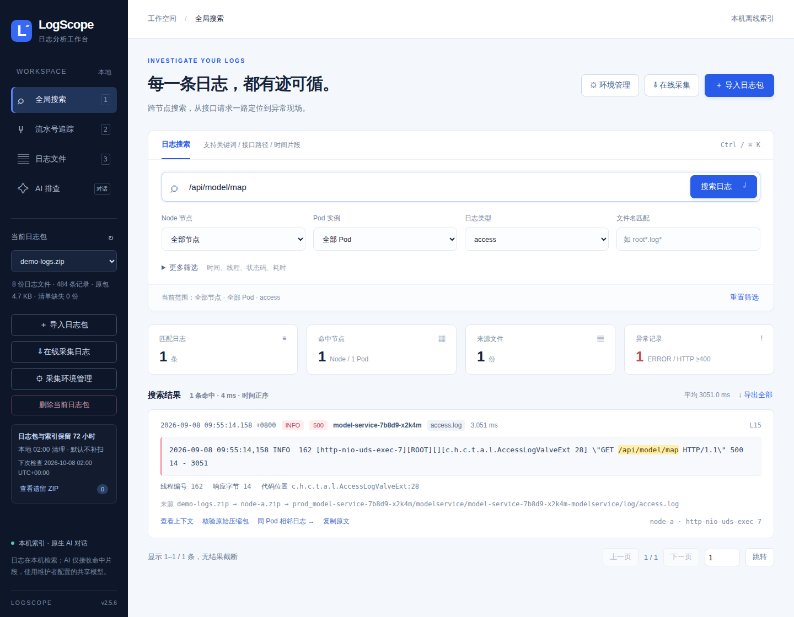
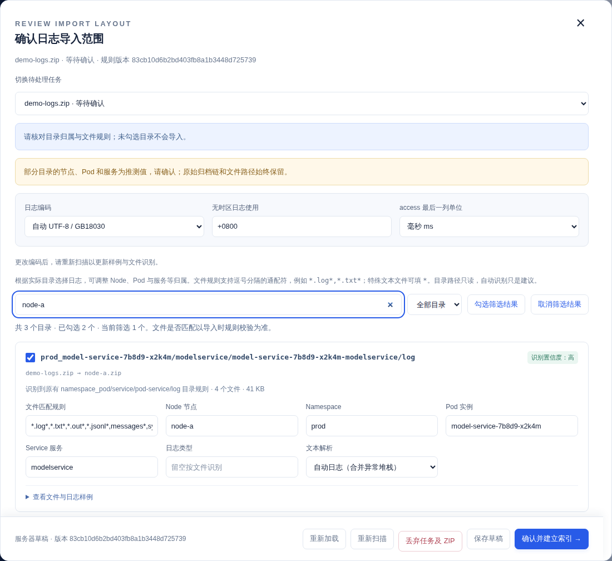
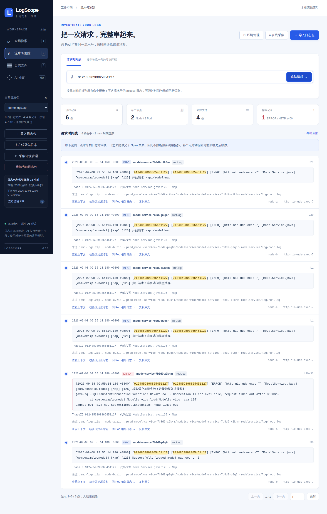
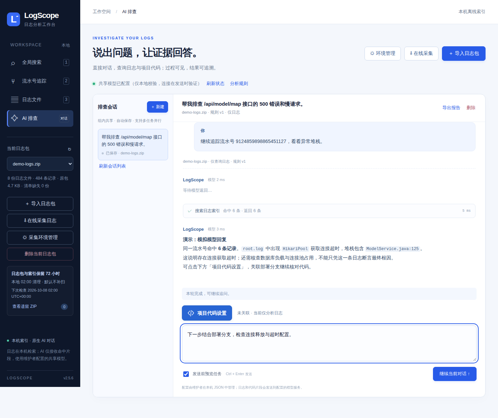
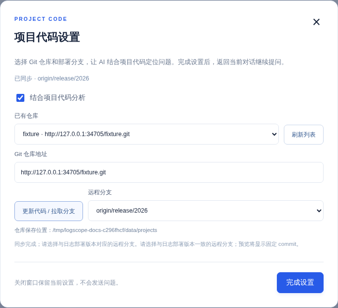

# LogScope · 多节点日志搜索与 AI 问题定位

**把 ZIP 日志包拖进来，从接口报错找到 Pod、异常堆栈，再结合代码追查原因。**

如果你也经常这样查问题：下载日志 → 逐个解压节点 ZIP → 进入 `log/` → `zgrep` 接口 → 记下时间 → 再翻 `root.log`，LogScope 把这段流程放进了一个中文网页工作台。

它在本机导入和搜索日志，支持嵌套 ZIP、GZIP 历史文件、跨节点搜索、流水号追踪，以及可选的 AI 多轮排查。Windows 可以直接运行一个 EXE；不配置模型，也能使用完整的日志搜索功能。

[下载 Windows EXE](https://github.com/520liyangzi/log-analyze/releases/download/windows-latest/LogScope.exe) · [下载演示日志 ZIP](https://github.com/520liyangzi/log-analyze/raw/refs/heads/main/docs/examples/demo-logs.zip) · [完整使用手册](docs/USER_GUIDE.md) · [发帖介绍稿](docs/SHARE.md) · [反馈问题](https://github.com/520liyangzi/log-analyze/issues)



## 能帮你做什么

| 你遇到的情况 | 在 LogScope 中怎么做 |
|---|---|
| 不知道请求落在哪个 Pod | 在当前日志包内一次搜索所有节点，按需叠加 Node、Pod、服务和日志类型 |
| 找到接口报错，还要翻正式日志 | 从 access 记录跳到“同 Pod 相邻日志”，继续看 root/run 等日志 |
| 手里只有一串流水号 | 输入完整 ID，按时间排列跨 Pod 的相关记录与异常堆栈 |
| 日志藏在多个 ZIP、`.log.gz` 里 | 直接导入外层 ZIP，结果保留归档链、文件路径和原始行号 |
| 不同服务的日志目录不统一 | 先预览目录与样例，确认或修改归类，再建立索引 |
| 想让 AI 帮忙定位 | 直接在页面提问，查看工具查询证据、继续追问、保存和导出报告 |
| 只看日志还不够 | 关联 Git 仓库与部署分支，让 AI 查询固定代码版本 |

## 1. 先启动：Windows 一个 EXE 即可

1. 下载 [LogScope.exe](https://github.com/520liyangzi/log-analyze/releases/download/windows-latest/LogScope.exe)，放进固定目录，例如 `D:\LogScope\`。
2. 双击启动，浏览器会自动打开；也可以访问 **http://127.0.0.1:8765**。
3. 下载 [demo-logs.zip](https://github.com/520liyangzi/log-analyze/raw/refs/heads/main/docs/examples/demo-logs.zip)，点击页面右上角 **导入日志包**，先体验下面的示例。

上传、搜索、流水号和 AI 对话不需要另装 Python、Node.js、Docker 或数据库。结合项目代码时，运行服务的电脑需要安装 Git；在线采集需要你自己的 Python 脚本及依赖。

**升级：先关闭旧程序，再替换 EXE，完整保留同目录的 `data/`。** 未过期的日志和 AI 会话可继续使用。源码在 `main` 分支，Windows 成品同时发布到 [Release](https://github.com/520liyangzi/log-analyze/releases/tag/windows-latest) 和 [`exe` 分支](https://github.com/520liyangzi/log-analyze/tree/exe)。

<details>
<summary>想用 Python 源码启动？</summary>

需要 Python 3.10+；运行时只使用 Python 标准库。

```bash
git clone https://github.com/520liyangzi/log-analyze.git
cd log-analyze
python app.py
```

Linux / macOS 可将 `python` 换为 `python3`。然后打开 http://127.0.0.1:8765，保持服务窗口运行。端口占用时使用 `python app.py --port 8877`。

</details>

## 2. 导入日志：先看目录，再确认

上传 ZIP 后，程序先扫描目录、抽取少量样例，**此时还没有建立全文索引**。你可以检查需要导入的目录，调整文件名匹配、Node、命名空间、Pod、服务和日志类型，再确认导入。



支持常见的“外层 ZIP → 节点 ZIP → 服务目录 → 日志文件”，也支持 ZIP 根目录、`logs/` 或其他目录中的文本日志，不强制某个服务专用层级。`.log.gz` 也可以直接读取。若识别不准，在确认页面修改即可，详细操作见 [目录确认导入指南](docs/IMPORT_LAYOUT.md)。

临时不想导入？在首页“导入任务”里直接点 **取消导入**。待确认或失败任务确认取消后，会删除服务端这次上传的 ZIP、草稿及残留索引，完成后从列表消失；关闭确认窗口只是暂存任务，不会取消。

**目录灵活不等于任意字段都能识别。** 未识别的文本仍可关键词搜索；时间、流水号、接口等结构化筛选依赖日志格式。不支持加密 ZIP、7z、rar、tar 和二进制日志。

## 3. 用演示包，完整查一次 HTTP 500

演示包由 [demo.py](demo.py) 生成，全部是虚构数据：**2 个 Node、2 个 Pod、8 份日志文件**，含正常请求、HTTP 500、连接池超时堆栈和 GZIP 历史日志。EXE 用户直接下载 ZIP 即可；源码用户也可执行 `python demo.py` 自行生成。

| 步骤 | 操作 | 预期看到什么 |
|---|---|---|
| ① 找接口 | 输入 `/api/model/map`，日志类型选 `access` | 160 条记录，来自两个节点 |
| ② 找失败请求 | 展开“更多筛选”，HTTP 状态填 `5xx` | 1 条 HTTP 500，耗时 3051 ms |
| ③ 找异常现场 | 点击这条记录的“同 Pod 相邻日志” | 自动限定相同 Node/Pod 和相邻时间，查看 root/run 等日志 |
| ④ 跟踪请求 | 点击 ERROR 记录的“追踪流水号”，或在追踪页输入 `9124859898865451127` | 跨两个 Pod 的 6 条记录，包含连接池超时堆栈 |
| ⑤ 查历史压缩文件 | 回全局搜索，清空前面的筛选，搜索 `gzip-history-hit` | 两个节点各命中一份 `.log.gz`，可查看完整来源 |



搜索结果可翻页查看全部命中，或点击 **导出全部** 下载 NDJSON，每条包含原文和来源。点击 **查看上下文** 看原文件前后记录；需要复核时，点击 **核验原始压缩包** 回读对应文件。

日常搜索还可以这样用：

| 想查什么 | 输入或筛选示例 |
|---|---|
| 某个 Pod 的异常 | Pod 选目标实例，级别选 `ERROR` |
| 只看 root 及历史文件 | 文件名填 `root*.log*` |
| 超过 1 秒的接口请求 | 类型选 `access`，最低耗时填 `1000` ms |
| 按日志时间缩小范围 | 直接粘贴 `2026-09-08 09:55:14.186`，无需用日历逐项选择 |
| 精确查接口 | 在“接口路径精确匹配”中填 `/api/model/map` |

筛选条件之间是 **AND** 关系；主搜索框匹配连续文本，默认忽略英文大小写，不是正则或多关键词 OR。空关键词可浏览所选范围。页面会记住当前浏览器的搜索条件和输入草稿。

**关联结果需要核对：** access 没有流水号时，只能先通过 Pod、时间和可选线程寻找候选日志；线程复用、异步切换可能造成误关联。HTTP 200 也不代表业务一定正常，流水号时间线也不等于完整的父子调用链。

## 4. 可选：直接与 AI 对话排查

页面内置对话，不依赖 Claude、codeagent 或网页终端。AI 通过工具查询已导入的索引，必要时核验原包、搜索代码；你可以展开工具记录，看到查询条件、耗时和证据。



维护者在首次启动后生成的 `data/ai-config.json` 中填写模型配置，页面不会显示 API 地址或密钥：

```json
{
  "provider": "openai",
  "base_url": "https://your-model-gateway.example/v1",
  "api_key": "填写你的 API Key",
  "model": "填写接口要求的模型名称"
}
```

保存后点击 AI 页的 **刷新状态**，无需重启。支持 OpenAI-compatible Chat Completions 和 Anthropic Messages；所用网关和模型需要支持工具调用。内网 HTTP 地址也可用，具体协议、参数和故障处理见 [AI 配置指南](docs/NATIVE_AI.md)。

选择演示日志包，进入 **AI 排查**，试着输入：

> 帮我排查 /api/model/map 为什么返回 500。先检查 access 的状态和耗时，再关联同 Pod 的正式日志。请列出文件、行号和流水号，区分已确认的事实与仍需验证的原因。

默认先预览任务，再确认发送。接着在同一会话追问：

> 另一个 Pod 在相同时间有没有异常？连接池超时是直接原因还是根因，还需要哪些证据？

点击 **继续当前对话** 会携带已有问题、回答和查询证据。支持同时发起多个排查任务，会话自动保存，可切换、停止、删除和导出报告；“新建”才会开启另一段对话。分析另一份日志包时，请新建会话。并发任务仍会共用服务电脑资源和模型接口额度。

AI 查询复用现有索引，不会每轮重新导入日志；总耗时还包含模型推理和多轮查询。**启用 AI 后，命中的日志和代码片段会发送到所配置的模型服务**，请选用适合你们日志数据的接口。

> 本 README 截图使用虚构日志；AI 界面演示使用本机模拟模型，用于展示操作流程，不代表真实模型的定位效果。

## 5. 结合项目代码，继续定位原因

在对话输入框上方点击蓝色 **项目代码设置**，弹窗中关联仓库与分支：



1. 填写 Git URL，或选择已经导入的仓库。
2. 点击 **更新代码 / 拉取分支**：首次 clone，已有仓库 fetch，代码保存在服务电脑的 `data/projects/`。
3. 选择与日志实际部署版本相符的远程分支，点击 **完成设置** 返回对话。
4. 发送前核对预览中的仓库、分支与 commit，再让 AI 分析。

可以继续问：

> 请结合关联的代码版本，搜索 ModelService 的请求处理和异常传播路径。解释哪些代码对应日志证据，给出排查或修复建议，不要把推测写成已确认根因。

分析固定在预览确认的 commit；其他人更新同一仓库不会改变当前会话的代码版本。需要新版本时主动更新并重新预览。打开设置本身不会拉代码或发送问题；代码查询也不会执行项目构建或业务程序。

服务电脑需能访问 Git 仓库，并提前配置好 Git 凭据或 SSH 密钥。不要在 URL 中放密码或 token。代码版本与日志不匹配时，定位结论也可能偏离实际情况。

## 6. 在线采集与组内使用

**已有采集脚本的用户：** 把自己的 `collect_logs.py` 放在 `LogScope.exe` 或 `app.py` 同目录，并准备好该脚本的 Python 环境。仓库不包含你们平台的私有采集实现。

页面点击 **在线采集**，填写 Pod、开始/结束时间以及平台地址、用户名、密码；也可先通过 **环境管理** 保存环境，采集时选择回填。下载完成后仍会先显示目录确认，再建立索引。

平台地址填写到端口即可，例如 `https://192.0.2.10:31945`。端口必填（1–65535），末尾不要加 `/`，也不要附带页面路径或查询参数。填写有误时会在地址框下方提示原因；已有环境可在 **环境管理** 中修改。

集成的脚本调用形式如下，LogScope 会另行传入本次任务的 `--output` 目录：

```bash
python collect_logs.py --pod model-service --start "2026-09-08 09:50:00" --end "2026-09-08 10:00:00"
```

**让同事访问你的电脑：** 默认仅本机可访问；在可信组内可这样启动，然后访问 `http://服务电脑IP:8765`：

```powershell
.\LogScope.exe --host 0.0.0.0
# 源码方式：python app.py --host 0.0.0.0
```

当前没有登录或会话隔离，组内共用日志、AI 会话和模型配置；不适合暴露到公网。同事的浏览器无需安装 Python 或 Git。

## 7. 数据放哪、什么时候删除

| 内容 | 默认位置 | 默认清理策略 |
|---|---|---|
| 原始 ZIP | `data/archives/` | 随过期日志包一起删除 |
| 日志记录与检索索引 | `data/logs.sqlite3` 及伴随文件 | 随过期日志包一起删除 |
| AI 会话、工具证据与报告 | `data/chat.sqlite3`、`data/chat-sessions/` | 保留，可在页面删除会话 |
| 模型配置与采集环境 | `data/ai-config.json`、`data/collector-environments.json` | 保留 |
| Git 代码缓存 | `data/projects/` | 保留，不随日志包清理 |

默认在**服务电脑本地时间每天凌晨 02:00**，清理导入完成已满 **72 小时**的日志包，包含 **原始 ZIP、日志和索引**。程序需在该时刻运行；默认错过不在启动时补扫。需要长期留存的 ZIP，请保留自己上传的原文件，或在清理前从服务电脑的 `data/archives/` 另行备份。

也可点击 **删除当前日志包** 主动清理，旧版本遗留的过期原包可在 **查看遗留 ZIP** 中下载或删除。删除日志不等于删除整个 `data/`，AI 历史、配置和代码缓存会继续保留。详细策略、清理进度与停止方式见 [日志保留与自动清理](docs/RETENTION.md)。

压缩包大小不等于展开后的日志大小，索引也会占用额外磁盘。导入速度受日志总量、压缩层级和磁盘性能影响，不承诺固定秒数；后续查询复用索引。

## 更多说明与反馈

- [完整使用与维护手册](docs/USER_GUIDE.md)：筛选规则、日志格式、资源上限、升级和本地构建。
- [目录确认导入](docs/IMPORT_LAYOUT.md)：目录识别不准时怎么调整。
- [AI 对话与项目代码](docs/NATIVE_AI.md)：模型配置、分析规则、多轮会话和 Git 仓库。
- [可选外部 CLI / Skill](docs/AGENT.md)：已有外部 AI 工具时复用只读查询能力。
- [提交 Issue](https://github.com/520liyangzi/log-analyze/issues)：请附版本、操作步骤、脱敏日志片段与文件路径；不要上传真实密钥或敏感日志。
